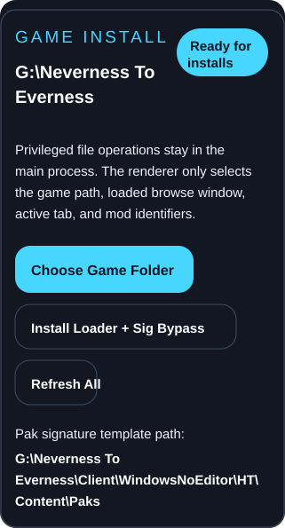

# NTE Mod Manager

Desktop mod manager for **Neverness to Everness** with a safer install flow for GameBanana and local archive-based mods.

[Download the current Windows release](https://github.com/KingKrab23/NTEModManager/releases/tag/v0.1.0)

## What you need to do

1. Open the app and click `Choose Game Folder`.
2. Select your `Neverness to Everness` install root, not the inner `Paks` folder.
3. Click `Install Loader + Sig Bypass` so the required framework files are copied into the game.
4. Confirm the app shows a valid Pak signature template path under `HT\\Content\\Paks`.
5. Refresh if needed, then browse GameBanana mods and install a supported `.zip`, `.7z`, or `.rar` file.

## Current scope

- Validates the selected game install before writing files.
- Installs the required loader and signature-bypass files.
- Browses recent NTE GameBanana mods, previews details, and installs supported archives.
- Records installed mods so they can be refreshed or uninstalled later.

## Notes

- This repo currently ships a Windows release artifact.
- File writes stay in the Electron main process with backup and rollback-oriented behavior where practical.
